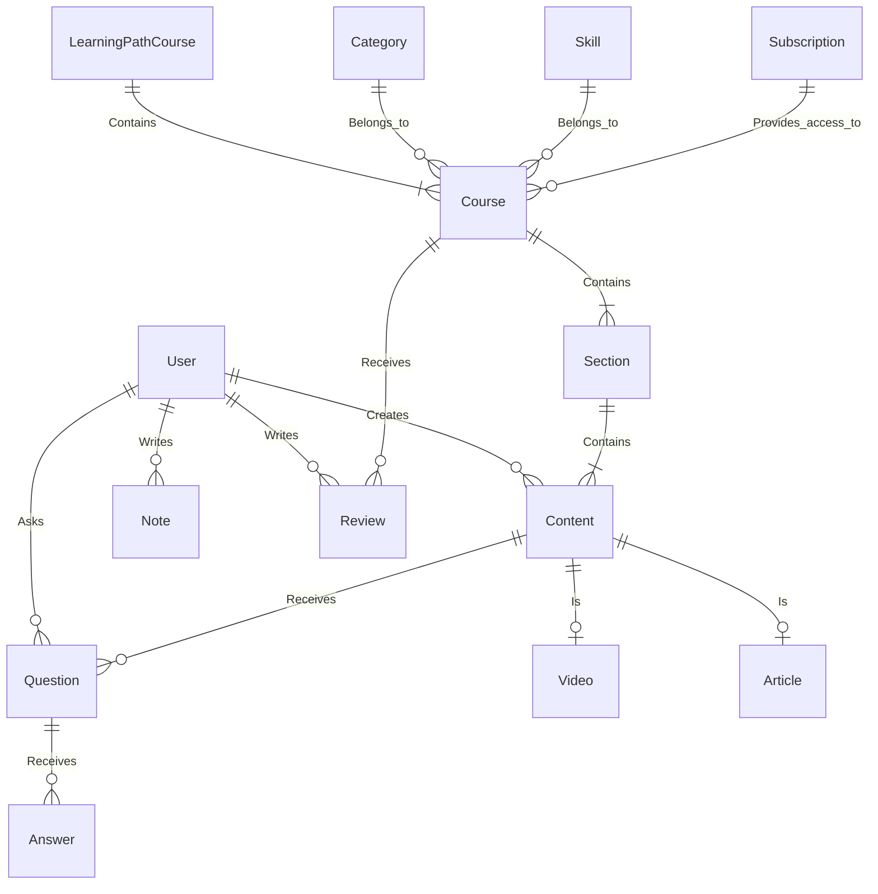

```mermaid
erDiagram
	User ||--o{ Content : Creates
    User ||--o{ Note : Writes
    User ||--o{ Review : Writes
    User ||--o{ Question : Asks
    
	Content ||--o| Video : Is
	Content ||--o| Article : Is
	
	Content ||--o{ Question : Receives
	Question ||--o{ Answer : Receives
	
	Course ||--|{ Section : Contains
	Course ||--o{ Review: Receives
	Section ||--|{ Content: Contains
	
	LearningPathCourse ||--|{ Course : Contains
	
	Category ||--o{ Course : Belongs_to
	Skill ||--o{ Course : Belongs_to

	Subscription ||--o{ Course : Provides_access_to	
```

