# User Entity
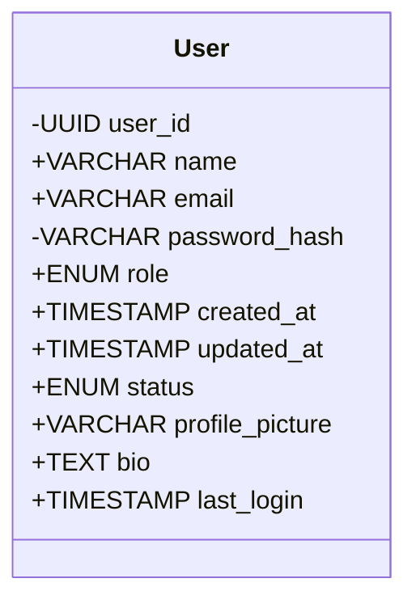
# Content
- It can be a `Article` or `Video`
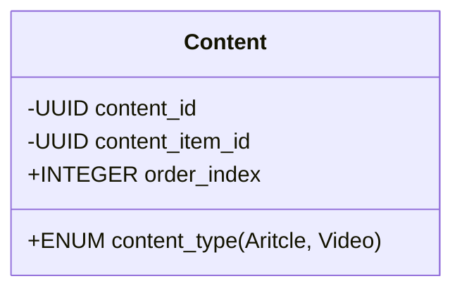
## Video
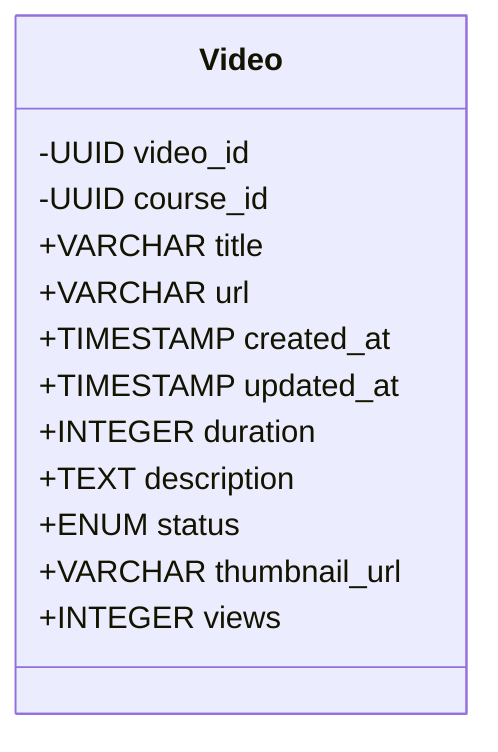
## Article
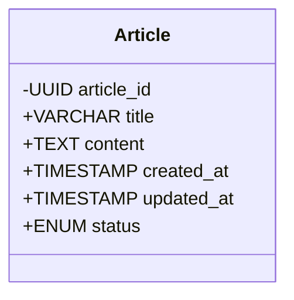

# Course
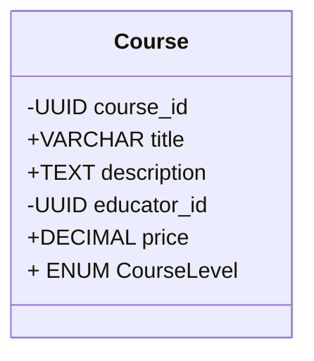
# CourseCategory and CourseSkills
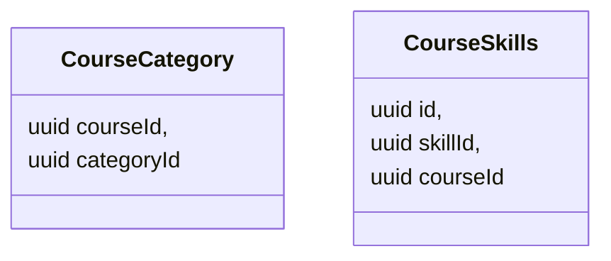
# Course Objectives, Target Audience & Prerequisites
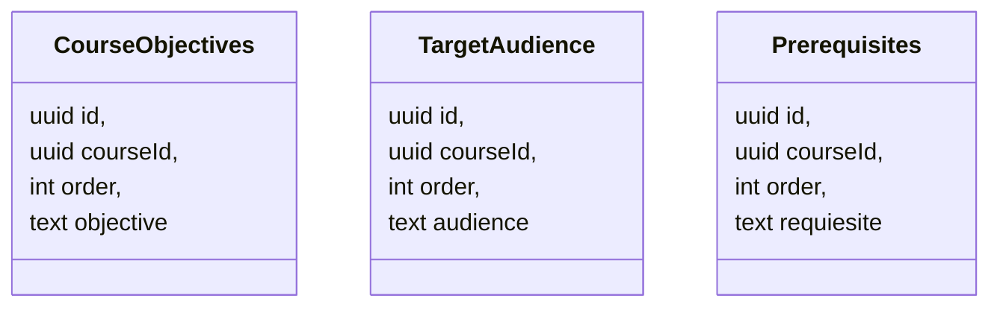
# Section
- Groups of content, helps to organise courses effectively
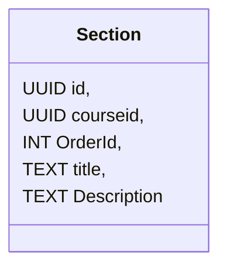

## `CourseSection`
Bride between Section and Courses
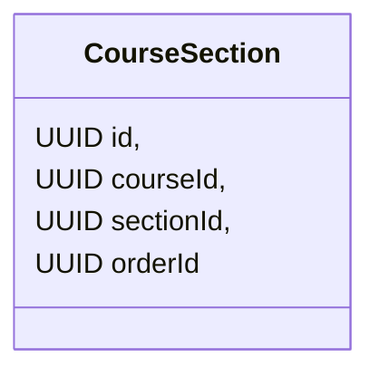
### Section Content
- A Bride between section and series of content
- A `Section` might have many `CourseContent` of different types
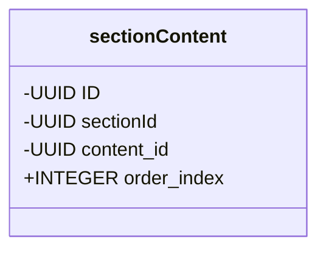
# Learning Paths
- For example, `MERN` dev learning path would be comprised of series of courses that the user might have to take to become a solid developer
- It might start with courses like `Getting into Web dev`, Followed by `React`, `NodeJS` and `MongoDB`
- `LearningPathCourse` bride between `LearningPath` and series of `Course`s
- `LearningPath` might contain 1 to many `courses`
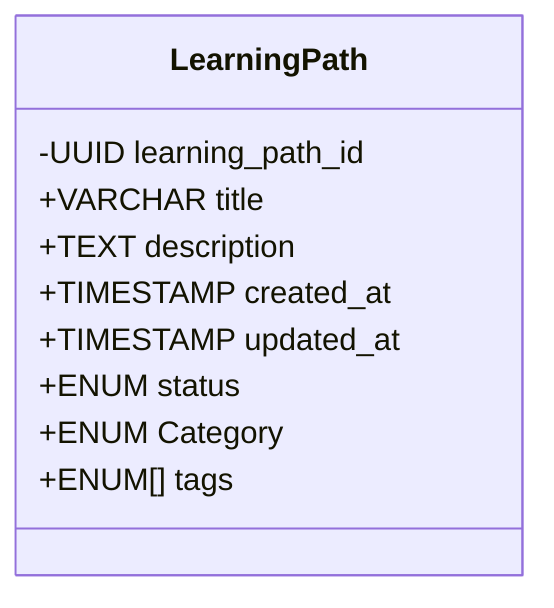
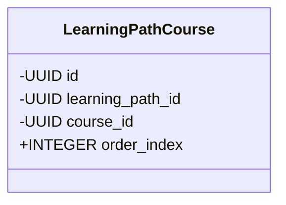
# Subscriptions
- With Subscription, according to business logic user can access set of courses are whole of courses
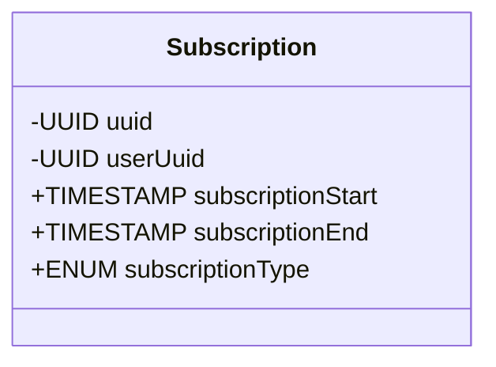
# Notes
- A `note` has to be related to a `content`
- That way notes can be gathered together with contents as an overview note
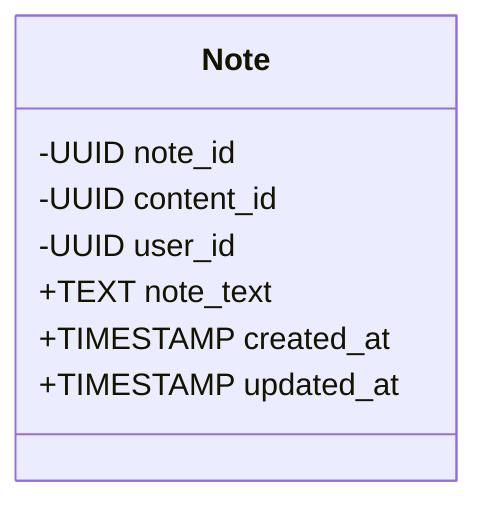

# Review
- Reviews by students that are taking a particular course
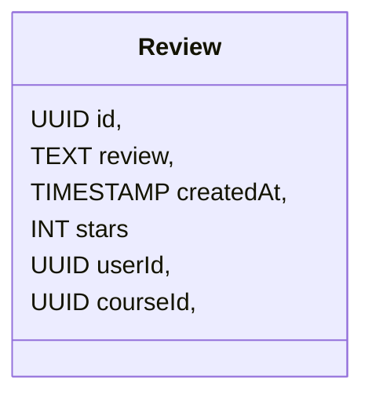
# Questions & Answers
Questions are related to individual `content`, can be a video, article
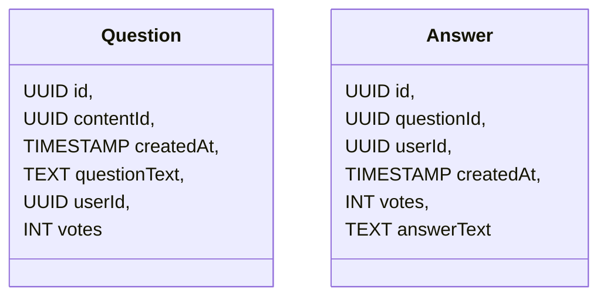

# Course Category and Skills
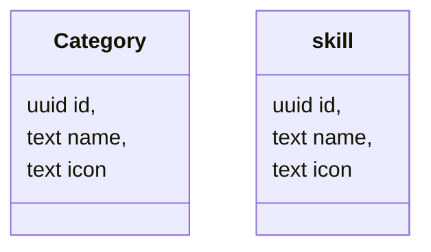