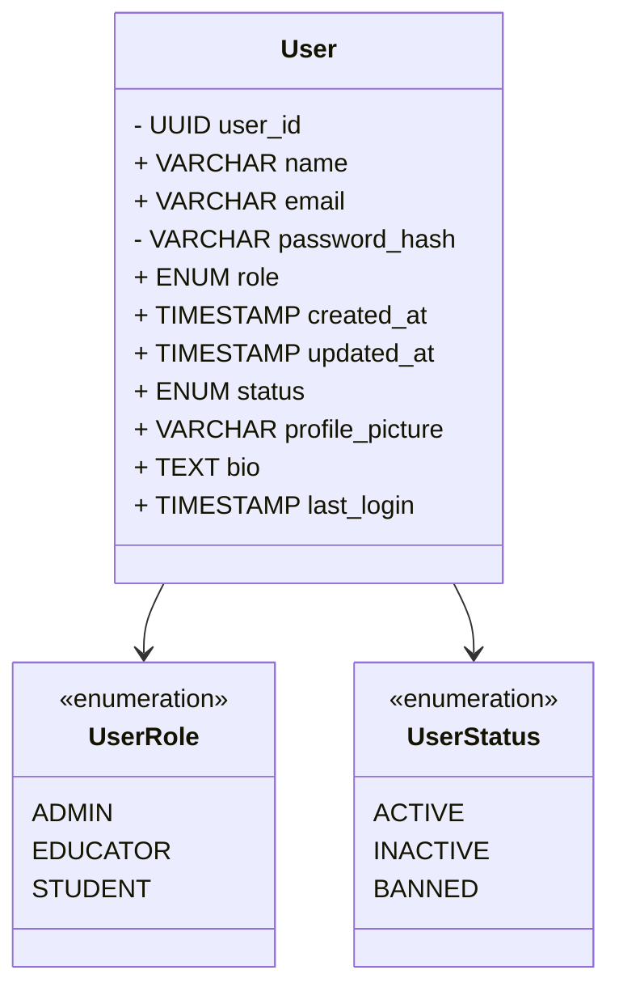
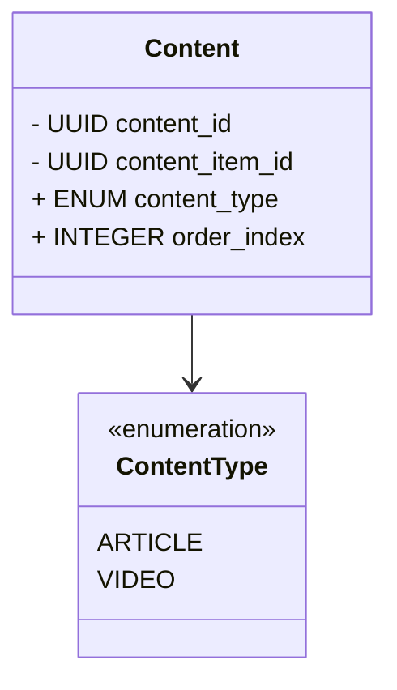
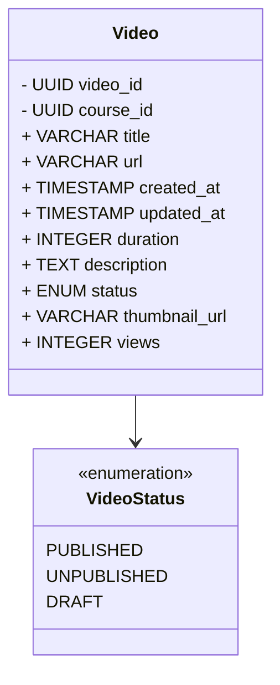
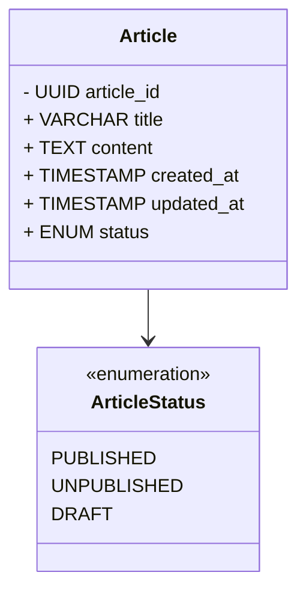
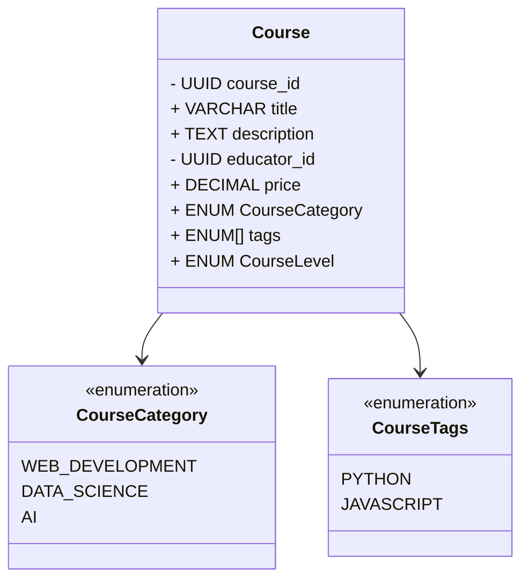
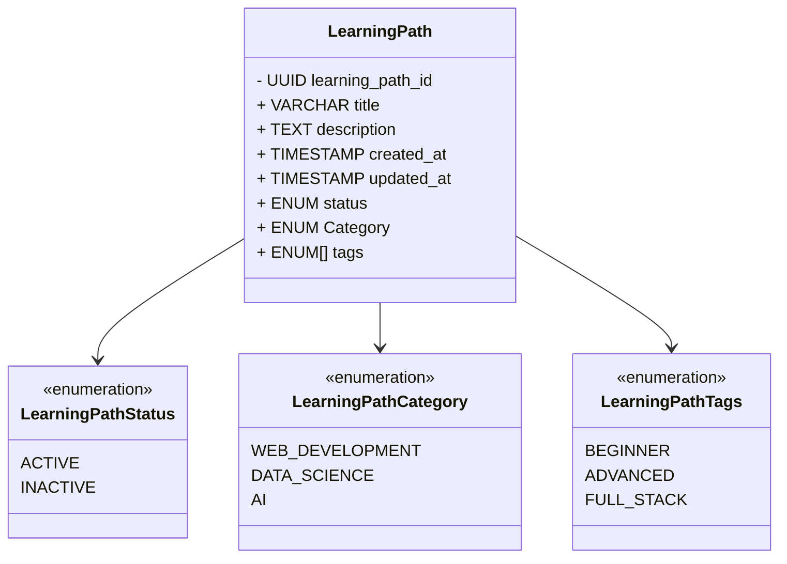
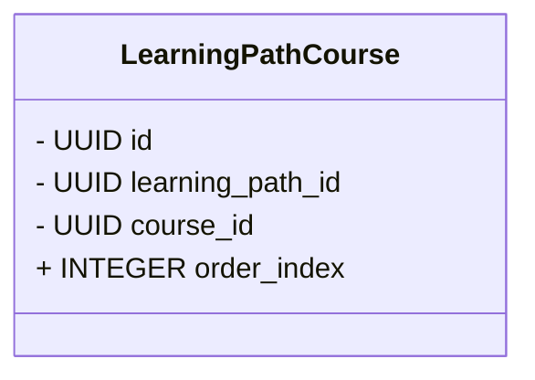
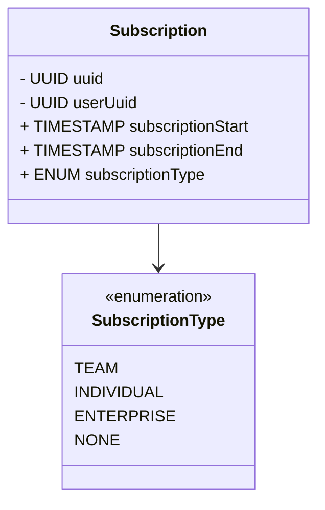

### User

```mermaid
classDiagram
    class User {
        - UUID user_id
        + VARCHAR name
        + VARCHAR email
        - VARCHAR password_hash
        + ENUM role
        + TIMESTAMP created_at
        + TIMESTAMP updated_at
        + ENUM status
        + VARCHAR profile_picture
        + TEXT bio
        + TIMESTAMP last_login
    }
    class UserRole {
        <<enumeration>>
        ADMIN
        EDUCATOR
        STUDENT
    }
    class UserStatus {
        <<enumeration>>
        ACTIVE
        INACTIVE
        BANNED
    }
    User --> UserRole
    User --> UserStatus
```

### Content

```mermaid
classDiagram
    class Content { 
        - UUID content_id 
        - UUID content_item_id 
        + ENUM content_type 
        + INTEGER order_index 
    }
    class ContentType {
        <<enumeration>>
        ARTICLE
        VIDEO
    }
    Content --> ContentType
```

### Video

```mermaid
classDiagram
    class Video {
        - UUID video_id
        - UUID course_id
        + VARCHAR title
        + VARCHAR url
        + TIMESTAMP created_at
        + TIMESTAMP updated_at
        + INTEGER duration
        + TEXT description
        + ENUM status
        + VARCHAR thumbnail_url
        + INTEGER views
    }
    class VideoStatus {
        <<enumeration>>
        PUBLISHED
        UNPUBLISHED
        DRAFT
    }
    Video --> VideoStatus
```

### Article

```mermaid
classDiagram
    class Article {
        - UUID article_id 
        + VARCHAR title 
        + TEXT content 
        + TIMESTAMP created_at 
        + TIMESTAMP updated_at 
        + ENUM status 
    }
    class ArticleStatus {
        <<enumeration>>
        PUBLISHED
        UNPUBLISHED
        DRAFT
    }
    Article --> ArticleStatus
```

### Course

```mermaid
classDiagram
    class Course { 
        - UUID course_id
        + VARCHAR title
        + TEXT description
        - UUID educator_id
        + DECIMAL price 
        + ENUM CourseCategory
        + ENUM[] tags
        + ENUM CourseLevel
    }
    class CourseCategory {
        <<enumeration>>
        WEB_DEVELOPMENT
        DATA_SCIENCE
        AI
    }
    class CourseTags {
        <<enumeration>>
        PYTHON
        JAVASCRIPT
    }
    Course --> CourseCategory
    Course --> CourseTags
```

### Learning Paths

```mermaid
classDiagram
    class LearningPath {
        - UUID learning_path_id
        + VARCHAR title
        + TEXT description
        + TIMESTAMP created_at
        + TIMESTAMP updated_at
        + ENUM status
        + ENUM Category
        + ENUM[] tags
    }
    class LearningPathStatus {
        <<enumeration>>
        ACTIVE
        INACTIVE
    }
    class LearningPathCategory {
        <<enumeration>>
        WEB_DEVELOPMENT
        DATA_SCIENCE
        AI
    }
    class LearningPathTags {
        <<enumeration>>
        BEGINNER
        ADVANCED
        FULL_STACK
    }
    LearningPath --> LearningPathStatus
    LearningPath --> LearningPathCategory
    LearningPath --> LearningPathTags
```

### LearningPathCourse

```mermaid
classDiagram
    class LearningPathCourse {
        - UUID id
        - UUID learning_path_id
        - UUID course_id
        + INTEGER order_index
    }
```

### Subscription

```mermaid
classDiagram
    class Subscription {
        - UUID uuid
        - UUID userUuid
        + TIMESTAMP subscriptionStart 
        + TIMESTAMP subscriptionEnd 
        + ENUM subscriptionType
    }
    class SubscriptionType {
        <<enumeration>>
        TEAM
        INDIVIDUAL
        ENTERPRISE
        NONE
    }
    Subscription --> SubscriptionType
```

